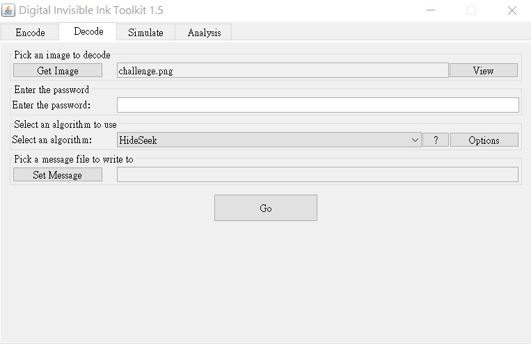
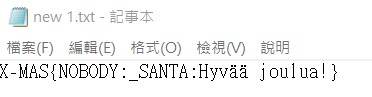

# Santa's letter
## Problem
> It seems that Santa may have used some Invisible Ink to write this letter… he is surely playing Hide&Seek.
>
> [Files](challenge.png)
---
## Writeup
The admins said to look carefully into the problem description. The "Invisible Ink" and "Hide&Seek" seem to be promising, so I searched online and found [Digital Invisible Ink Toolkit](http://diit.sourceforge.net/). After downloading it, choose your input and output, then choose "HideSeek" for the algorithm and get the flag.

