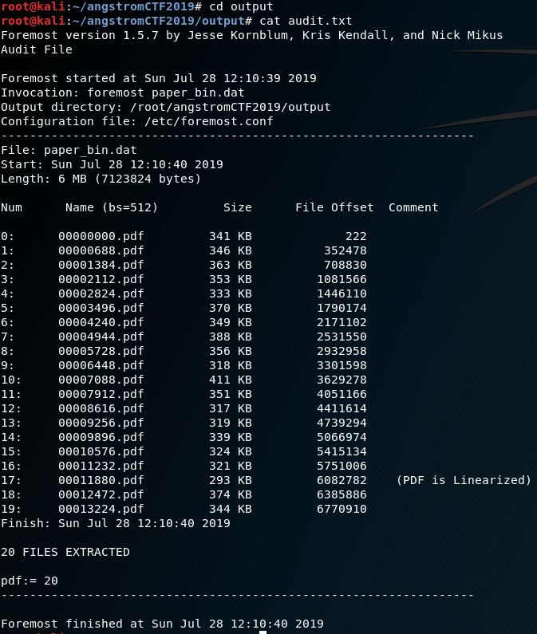

# Paper Bin
**40 points**
## Description
> defund accidentally deleted all of his math papers! Help recover them from his computer's raw data.
## Hint
> File carving
---
## Writeup
Since the hint says "File carving", let's search what it is.
[File carving](https://github.com/whaleshark271/CTF-CheatSheet/tree/master/Forensic#File-Carving)

Next, let's see what tool in kali linux can do file carving. After google, it seems that `foremost` can do the job. [foremost](https://github.com/whaleshark271/CTF-CheatSheet/tree/master/Forensic#Tools)

`foremost paper_bin.dat`

It gives us an `output` directory. In it there is an `audit.txt` saying "20 files extracted" and #17 says "PDF is linearized" [Linearized PDF](https://www.orpalis.com/blog/linearized-pdf/)

Open 00011880.pdf and the flag is right inside.

flag: actf{proof_by_triviality}