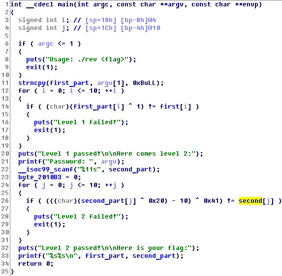
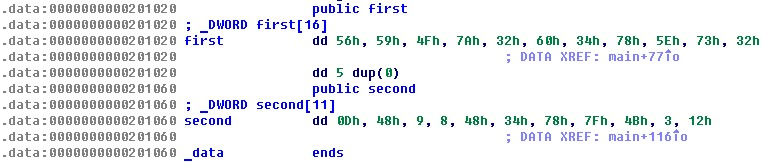

# Easy Reverse
## Description
> A simple reverse task.
> 
> Author: CSY54
> 
> [easy_reverse](easy_reverse)
---
## Writeup
Using IDA pro, we can see that the program compare the first part of flag xor 1 with `first` and compare the second part of flag xor 0x20 then minus 10 then xor 0x41 with `second`.



Here are the values of `first` and `second`.



Now use python to calculate what the flag should be.

First part:
```python
>>> print hex(0x56594F7A326034785E7332 ^ 0x0101010101010101010101)
0x57584e7b336135795f7233L
>>> bytearray.fromhex('57584e7b336135795f7233').decode()
u'WXN{3a5y_r3'
```

Second part:
```python
>>> print hex(0x0d4809084834787f4E0312 ^ 0x4141414141414141414141)
0x4c0948490975393e0a4253L
>>> print hex(0x4c0948490975393e0a4253 + 0x0a0a0a0a0a0a0a0a0a0a0a)
0x56135253137f4348144c5dL
>>> print hex(0x56135253137f4348144c5d ^ 0x2020202020202020202020)
0x76337273335f6368646c7dL
>>> bytearray.fromhex('76337273335f6368646c7d').decode()
u'v3rs3_ch4l}'
```

flag : WXN{3a5y_r3v3rs3_ch4l}