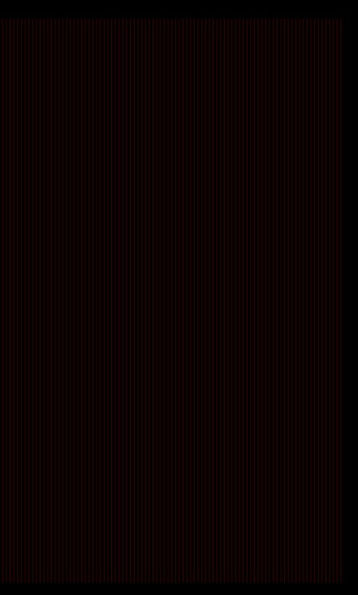
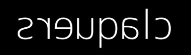

# Picture?
## Description
>is this picture?
>
>[picture.zip](picture.zip)
---
## Writeup
After downloading and unzipping `picture.zip`, there's `flag.zip` and `jjofpbwvgk.png` inside. `flag.zip` is encrypted, so the password is probably in `jjofpbwvgk.png`.

I couldn't open `jjofpbwvgk.png` since it's not a png file. After changing it to txt we got many rgb values. I guessed we should convert the values into a picture. With some counting we can find the picture should be of size 400 x 600.

First I tried to convert the values with [this method](https://stackoverflow.com/questions/50954783/converting-rgb-data-into-an-array-from-a-text-file-to-create-an-image) and got a weird picture with thin red stripes. This is clearly not the answer, so what went wrong?

After some searching and changing my script by [this method](https://stackoverflow.com/questions/48571486/converting-from-numpy-arrays-to-a-rgb-image), I got the correct picture. It seems that when PIL is calling `tobytes()` it could produce extra bytes, so we need `unit8` to rescale it to range 0 ~ 255. The password is 'claquers'.

After unzipping `flag.zip` with the password, we can find the flag.

flag : balqs{picture_password?}