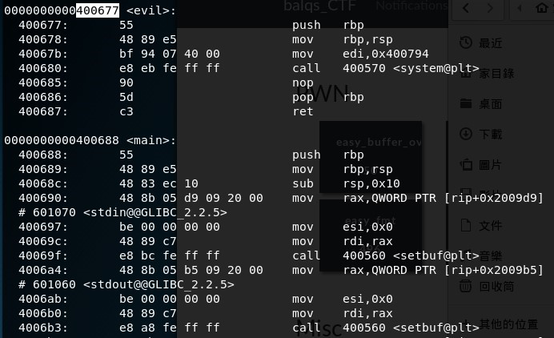
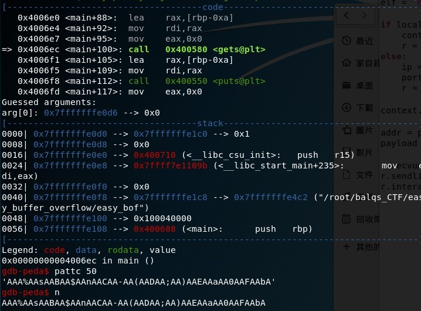
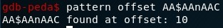
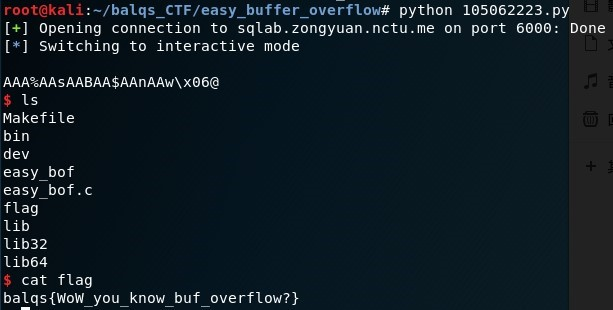

# easy_buffer_overflow
## Description
> nc sqlab.zongyuan.nctu.me 6000
>
> [easy_bof](easy_bof)  [easy_bof.c](easy_bof.c) [pwn.py](pwn.py)
---
## Writeup
Looking at `easy_bof.c`, we should use buffer overflow to change the return address to the address of `evil` to gain shell.

First use `objdump -M intel -d easy_bof` to check the assembly code.

Write down the address of evil(0x400677).

Next, open gdb and set a break point at main. After using `run` and keep pressing `n` to the code where it prompts for input, use `pattc 50` to generate a string and enter it as input.

We can see that the rbp is overridden by the string. Copy the first few overriding characters and use `pattern offset` to see that there are 10 characters before rbp. Then we can give 10 + 8(rbp) length of garbage and append the address to override the return address.

Using `pwn.py` provided by them, since it is 64 bit little endian, `addr` should be `p64(0x400677)` ,which looks like \x77\x06\x40\x00\x00\x00\x00\x00. Payload is 18 garbage + addr. After execution, we got the shell. Use `ls` to show all files and then use `cat` to show the flag.

flag : balqs{WoW_you_know_buf_overflow?}