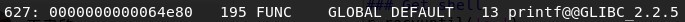
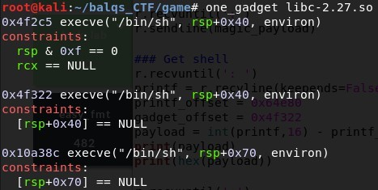
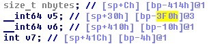
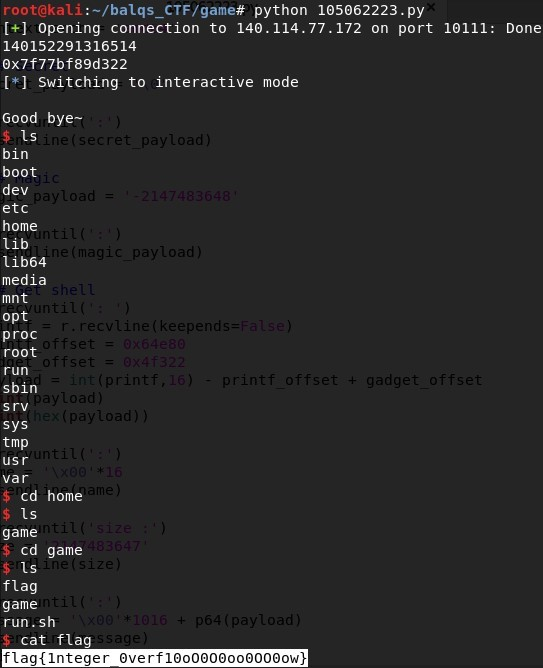

# game
## Description
> nc 140.114.77.172 10111
>
> [libc-2.27.so](libc-2.27.so) [game](game) [game.c](game.c)
---
## Writeup
We need to use integer overflow, buffer overflow and one_gadget to pass secret, magic number, size and leave message to get shell.

### Secret
The code uses `strncmp` to compare ans and input. Since `strncmp` only compare till it encounters null character `\0`, simply send `\0` to pass the comparison.

### Magic number
The code uses `abs()` on the input first, and since the range of int is -2147483648 ~ 2147483647, meaning there is no 2's complement for -2147483648. Enter -2147483648 to pass it.

### Get shell
First we need to calculate what the payload is. Use `readelf -a libc-2.27.so | grep printf` to get the offset of printf, then use `one_gadget libc-2.27.so` to get the offset of one_gadget (I used the second one for the payload).

After you pass secret and magic number the code will ask you for your name. You can only input at most 16 characters, the it will print the string "Your name is : ..." to message buffer.

Next it will ask for the size. Use integer overflow and input 2147483647 let it become negative when added 32. Then use IDA PRO to check how many null we should enter to cause buffer overflow. We could see that we should send 0x3F0 + 8(rbp) null appended with payload to override the return address.

flag : flag{1nteger_0verf10oO0O0oo0OO0ow}