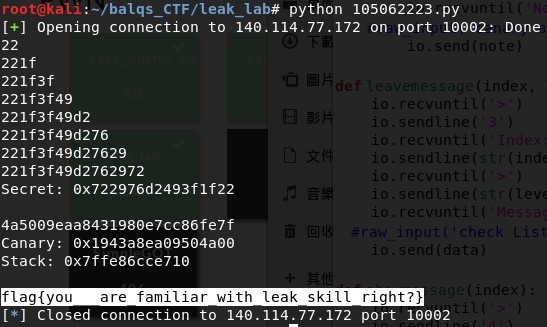

# leak_lab
## Description
>leak everything and get flag
>
>nc 140.114.77.172 10002
>
> [libc.so.6](libc.so.6) [leak](leak) [Leak.c](Leak.c)
---
## Writeup
We need to leak canary, stack and Secret to get the flag.

### Secret

By entering a string which length is longer than 8 to override TempSecret and use brute force to get secret.

Because the code compares `TempSecret` and `Secret` first and outputs "Something went wrong!" if they are not the same, so we could guess from 0x00 to 0xff, if there is "NoNoNo" then that means we've guessed the value of `TempSecret`(which is `secret`). Store the correct guess and go on to guess the next one until we've guessed all 8 characters, then we have `secret`.

### Canary and Stack

By entering a string of length 0x208 + 1 to leak canary and stack. Since `printf` will stop printing when it encounters 0x00, we can leak both canary and stack at once.

First enter `A*'0x208' + 'B'` to get canary and stack. 

Append `\x00` to the front of canary because canary always start with `\x00`, if you don't do this the program will crash. 

Append `\x00\x00` to the back of stack because `printf` stops print at `\x00`, so the last 2 characters must be `\x00`.

Remember to substract the offset (Use IDA to see that `s2` of `CheckAnswer` is `rbp-0x50`, use gdb to calculate `$rbp-0x50` the use leaked stack ot substract that value).

flag : flag{you__are_familiar_with_leak_skill_right?}