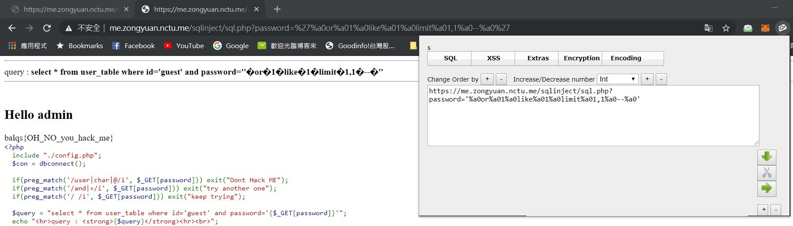

# sql injection 1
## Description
> 哇 一個網站藏 3 個 flag ，是怎辦到的阿
>
> 請用 https 連線
>
> 請不要拿工具掃他
>
> 因學校會做連線檢查 改成用 _POST 解法一樣
>
> cdx 上仍然是 _GET
>
> https://me.zongyuan.nctu.me/sqlinject/sql.php
>
> cdx : http://10.101.1.30/sqlinject/sql.php
---
## Writeup
Use `' or 1 like 1 limit 1,1 --'` and `%a0` to replace space and bypass the checking to get flag.

flag : balqs{OH_NO_you_hack_me}