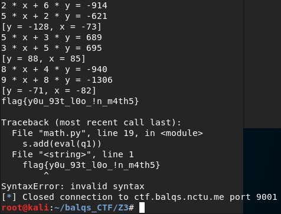

# Math teacher
## Description
> It's my math homework. Can you help me?
>
> nc ctf.balqs.nctu.me 9001
---
## Writeup
This problem gives you a lot of first-degree equations with two variables to solve. The format is as below
```
x + y = 2
x - y = 1
x =       # input
y =       # input
```

My method is to receive the first and second line, then use `replace()` to change = to ==. Next use `eval()` to turn the string to equation so it can be added to `s.add()`

Next is to use Z3 to solve the equations. First construct integer variable x and y, call a `Solver()` then use `s.add()` to add the equation into constraint.

Check if there is an answer and get the model. Submit the x and y from the model. At last my code will print the flag, but since it is not an equation, it will generate an error when going through `eval()`, then the code will stop.



flag : flag{y0u_93t_l0o_in_m4th5}