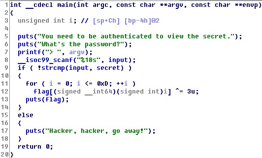
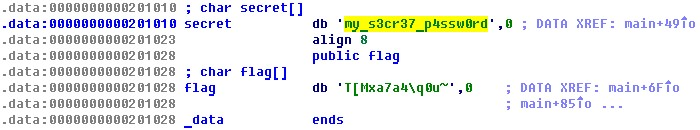

# Baby Reverse
## Description
> Ah, ha!
>
> Author: CSY54
>
> [baby_reverse](baby_reverse)
---
## Writeup
Using IDA pro on the binary file, the code checks if input is the same as `secret` and then outputs the flag.



By clicking on `secret` twice, we can find the value of `secret`, which is `my_s3cr37_p4ssw0rd`.



```shell
You need to be authenticated to view the secret.
What's the password?
> my_s3cr37_p4ssw0rd
WXN{b4b7_r3v}
```

flag : WXN{b4b7_r3v}