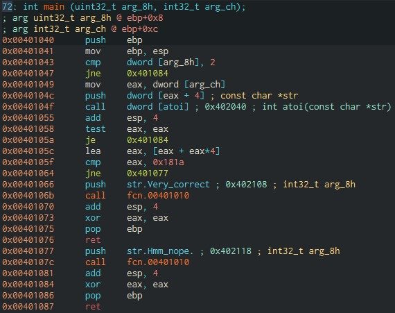

# Good_Luck
Below is the main function assembly code:



```assembly
push    ebp
mov     ebp, esp
cmp     dword [arg_8h], 2
jne     0x401084
```
The program first check if there is an argument for the program.

```assembly
mov     eax, dword [arg_ch]
push    dword [eax + 4] ; const char *str
call    dword [atoi] ; 0x402040 ; int atoi(const char *str)
add     esp, 4
test    eax, eax
je      0x401084
```
Then it gets the first argument and transfrom it from char string to an integer. Then it checks if `eax` is equal to zero. If not, continue.

```assembly
lea     eax, [eax + eax*4]
cmp     eax, 0x181a
jne     0x401077
push    str.Very_correct ; 0x402108 ; int32_t arg_8h
call    fcn.00401010
```
Here, it loads effective address of [eax + eax*4] into eax and compare it to 0x181a (6170). This means that `eax + eax*4 = 6170`, so we find that eax = 1234.

input: 1234