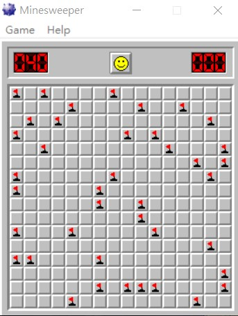

# Hacking Minesweeper (Changing the minefield)
This is a guided session on begin.re. It teaches how to make Minesweeper print flags where there are mines when starting up by changing the minefield in memory.

