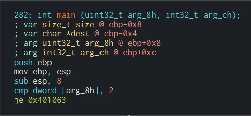
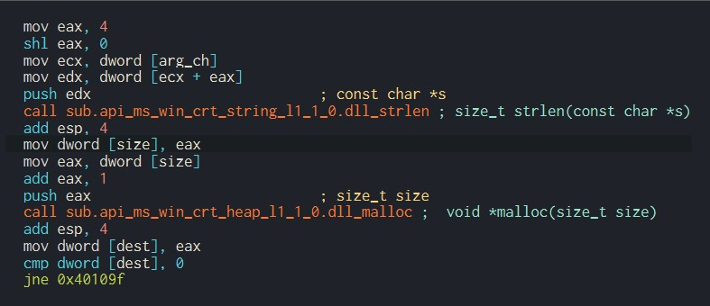
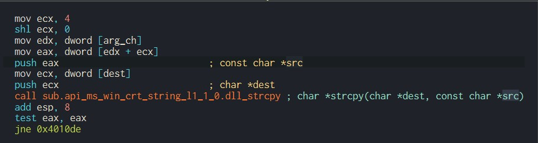
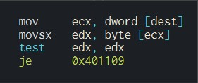
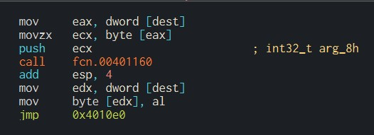
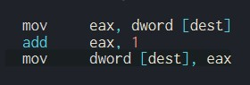

# Julia

The first block of the main function. It checks if there is an argument for the function.

Not sure what `shl eax, 0` is doing. (Edit: The hint says this does nothing, the compiler might have some issues.)

Starting from the third line, ecx holds the address of the argv array. Then, edx is assigned the address of the second element of argv (argument of the function).

The value of edx is pushed to the stack as the argument for `strlen()`. The return value of `strlen()` is stored in eax once it is finished.

The program then malloc a size of eax + 1 and store the address at dest. It checks if the function fails. If it doesn't, then continue from 0x40109f.

It pushes the address of the argument onto the stack and then pushes the address of dest. It then calls `strcpy()` to copy the input argument to the malloc space. It checks if the function fails, if not, jumps to 0x4010de then 0x4010e9.

## Loop

It moves the address of the copied string to ecx. `movsx` means move with sign extend. The program takes a byte out of the address (which is a character) and check if it is the end of the string.

It then push the character onto the stack and calls the function at 00401160. After that, the original byte is replaced by the returned byte of the function.

The address is added 1 to access the next byte and goes back to checking if the byte is the end of the string.

## Function at 00401160

The function first checks if the character is between a ~ z. If they are, the character is added 4 (check hexdump and find the address 0x403008) and keeps on checking if it is between A ~ Z. Otherwise, it directly checks if the character is between A ~ Z. If they are, the character is added 4. Otherwise, it is left untouched.

## The final comparison

It compares if the input string equals to VIMwXliFiwx. Since we now know that every character is added 4, we just need to substract each character by 4 to find the answer. The input string should be REIsTheBest.

input: REIsTheBest