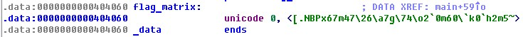
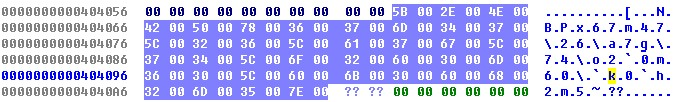
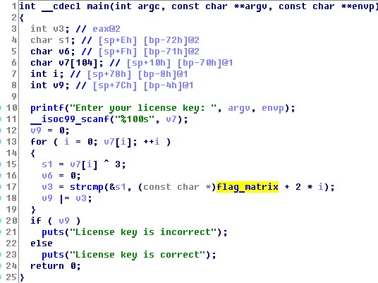

# Santa's crackme
## Problem
> So I found this login page, but I forgot the credentials :(
>
> [Files](main)
---
## Writeup
Open the binary with IDA and found a flag_matrix.

Then use F5 to look at source code and found that it xor the input string with 3 first and then compare it with flag_matrix. So if we xor flag_matrix with 3 and turn it to ascii, we would get the flag.

`\x5b\x2e\x4e\x42\x50\x78\x36\x37\x6d\x34\x37\x5c\x32\x36\x5c\x61\x37\x67\x5c\x37\x34\x5c\x6f\x32\x60\x30\x6d\x36\x30\x5c\x60\x6b\x30\x60\x68\x32\x6d\x35\x7e` xor `\x03` * 39 = `0x58, 0x2D, 0x4D, 0x41, 0x53, 0x7B, 0x35, 0x34, 0x6E, 0x37, 0x34, 0x5F, 0x31, 0x35, 0x5F, 0x62, 0x34, 0x64, 0x5F, 0x34, 0x37, 0x5F, 0x6C, 0x31, 0x63, 0x33, 0x6E, 0x35, 0x33, 0x5F, 0x63, 0x68, 0x33, 0x63, 0x6B, 0x31, 0x6E, 0x36, 0x7D`

flag : X-MAS{54n74_15_b4d_47_l1c3n53_ch3ck1n6}