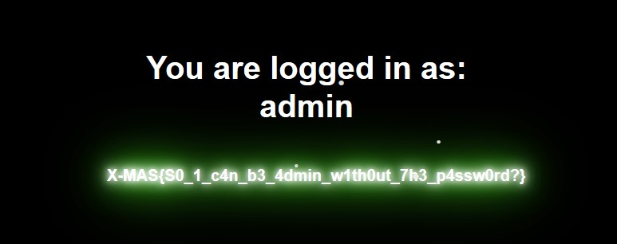

# Sequel Fun
## Problem
> I bet you can’t crack this!
---
## Writeup

This is clearly SQL injection as the problem name suggests. I tried `'or 1 = 1 #` but got "I don’t like the number 1 :(" as the response.

Well, how about `'or 2 = 2 #` ?

flag : X-MAS{S0_1_c4n_b3_4dmin_w1th0ut_7h3_p4ssw0rd?}