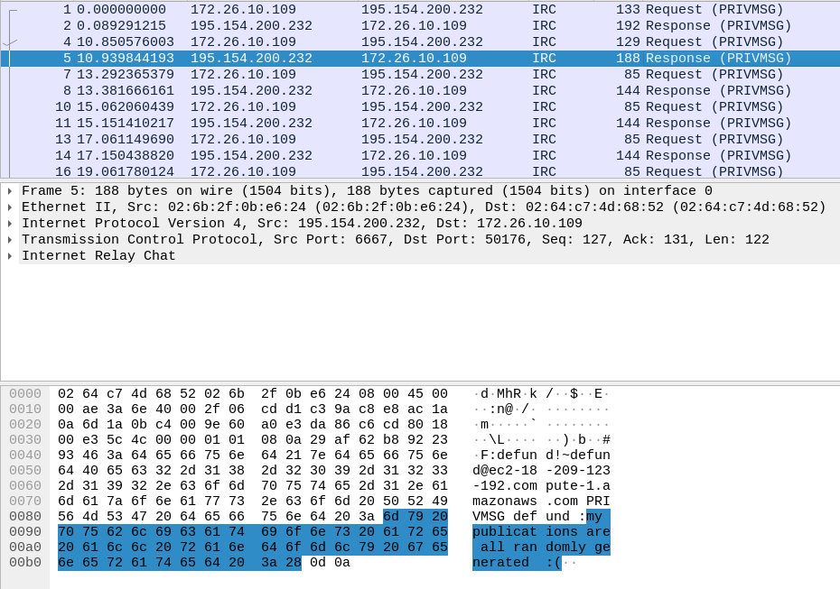

# Paper Trail
**50 points**
## Description
> Something is suspicious about defund's math papers. See if you can find anything in the network packets we've intercepted from his computer.
---
## Writeup
Use Wireshark to open `paper_trail.pcapng`.

Under protocal IRC request/response are some information. I went through all of them and put the flag back together.

There must be a faster way. Perhaps `scapy`?

flag: actf{fake_math_papers}