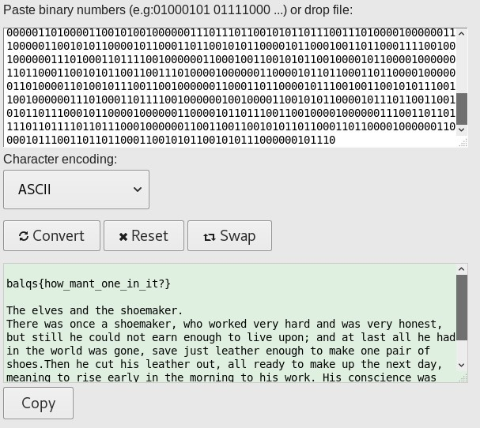

# 01?
## Description
> 0110001001101100011000010110001101101011001111010011000001101111011100100011000100111111
>
> [image.png](image.png)
---
## Writeup
First change the binary string from the description to ascii and we get 'black=0or1?'. We see that `image.png` is black and white checkered. We should change the image into a binary string according to the description and then change it to ascii.

The script take rgb values from the image and store them in a list. Next, we only have to check the every third value (since black is 0/0/0 and white is 255/255/255, we can just check one of the three values) and assign it 0 or 1 and write it into a text file. In order to get the flag, black should be assigned 0.
