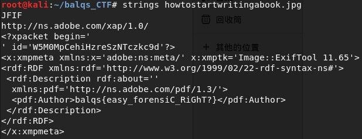

# For Beginner
## Description
> Basic Forensic
>
>[howtostartwritingabook.jpg](howtostartwritingabook.jpg)
---
## Writeup
Use `strings howtostartwritingabook.jpg` and you can find the flag at 'Author'.
