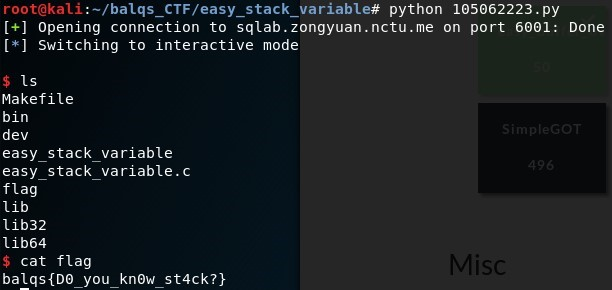

# easy_stack_variable
## Description
> nc sqlab.zongyuan.nctu.me 6001
>
> [easy_stack_variable](easy_stack_variable) [easy_stack_variable.c](easy_stack_variable.c)
---
## Writeup
We need to change `a`'s value to `0xdeadbeef` to get shell.

Using gdb and `pattc` like in `easy_buffer_overflow`, we can see there are 14 characters before rbp, which are the space for input and a. (Or you can get the same result from looking at the assembly code `mov DWORD PTR [rbp-0x4] 0x0)

So we only need to send 10 garbage characters and append `0xdeadbeef`(little endian) to get shell.

flag : balqs{D0_you_kn0w_st4ck?}