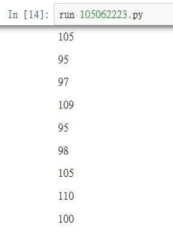
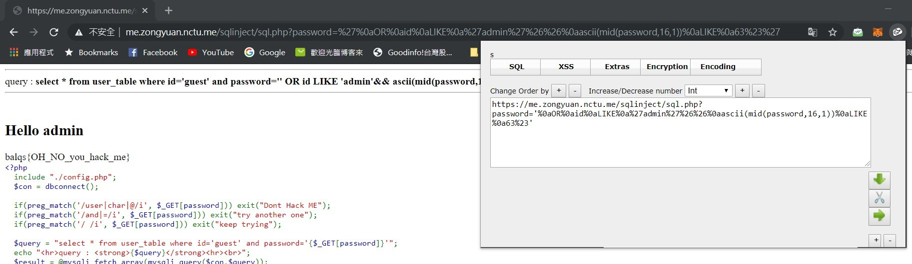

# sql injection 2
## Description
> 哇 一個網站藏 3 個 flag ，是怎辦到的阿
>
> 請用 https 連線
>
> 請不要拿工具掃他
>
> 因學校會做連線檢查 改成用 _POST 解法一樣
>
> cdx 上仍然是 _GET
>
> https://me.zongyuan.nctu.me/sqlinject/sql.php
>
> cdx : http://10.101.1.30/sqlinject/sql.php
---
## Writeup
Use `’or id like ‘admin’ %26%26 length(password) like 17#’` to guess the length of flag. The answer is 17.

Without balqs{} the rest of the flag should be of length 10. We can use a python script to brute force it. My script uses html code from 65 to 123 so I didn't guessed the last character, which is a question mark. But then I knew it should be a special character, and found it to be `?`.

The problem is when I was sending requests I encountered a verification problem. I added `verify=False` at r.requests to solve this (not sure if this is dangerous to do).

flag : balqs{i_am_bind?}