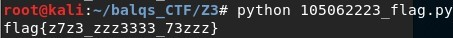

# Give me the flag
## Description
> [give_me_the_flag.py](give_me_the_flag.py)
---
## Writeup
First use `BitVec` to create a 24-bit vector variable. Every variable will have space of 8 bits and name each f_0 ~ f_24 representing the 24 characters of flag. 

Next call a `Solver()` and add the code of how the problem check for the flag into constraint.
Since the problem checks if the first 4 characters are flag, I added that to the constraint too.

Lastly check if it find an answer, and take the asnwer given by `model()` and change it to int using `as.long()` in the order of my_flag from 0 ~ 24 and get the flag.

flag : flag{z7z3_zzz3333_73zzz}