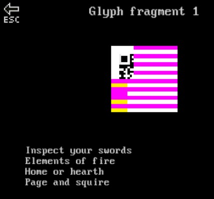
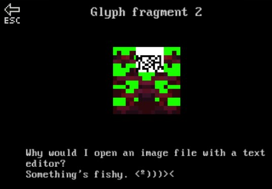
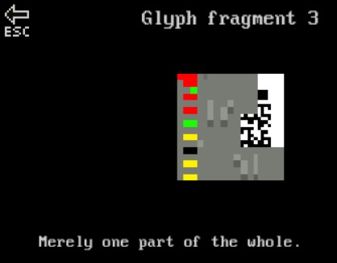
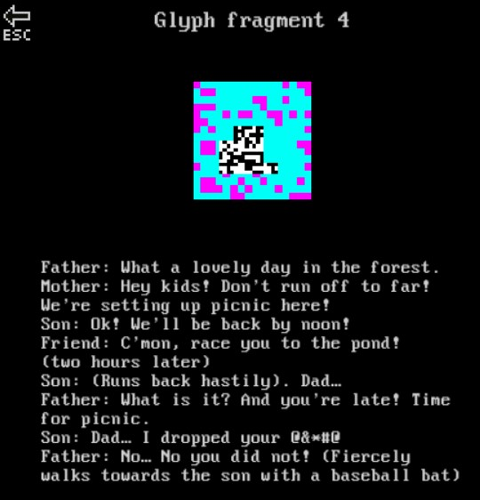
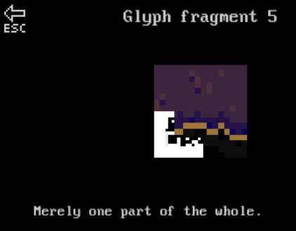
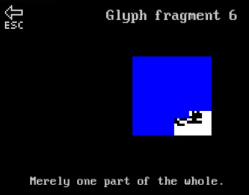
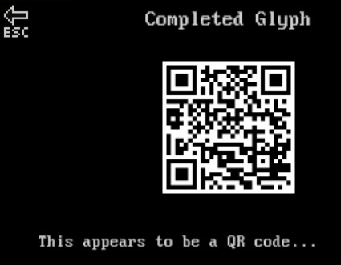
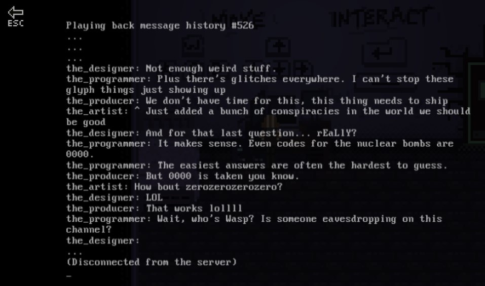

# The Factory's Secret
## Description
> There appear to be some mysterious glyphs hidden inside this [abandoned factory](https://2019game.picoctf.com/game)... I wonder what would happen if you collected them all?
## Hints
> Submit your answer in our competition's flag format. For example, if you answer was 'hello', you would submit 'picoCTF{hello}' as the flag.
---
## Writeup
The abandoned factory is the game of picoctf. You will need to find glpyhs in every door(category).

First you need to solve the 2 warm up challenges of General Skills to proceed to the doors.

**General Skills** : The glpyh is right in front of you when you enter.

**Web Exploitation** : This one is a bit like a maze. Go to the top right cave first and it will lead you to the bottom right of the map. Push the stone into the lava and go in where the stone was, it will lead to you the glyph.

**Cryptography** : I went through the tombs one by one and found the glpyh at the right side 6th row counting from bottom and the 5th one counting from left to right.

**Binary Exploit** : I went through the door in the order of blue->red->blue->red. I forgot how many times you have to go through the doors in this order, but the music will speed up indicating you are on the right path. Eventually a yellow door will show up and the glyph is inside.

**Forensics** : The plyph is at the pond where the propagation wave is.

**Reversing** : This one is a bit tricky. You have to go to the top right corner of General Skills and translate the morse code : `pillar2413`. Go back to reversing and open the switch in that order and you will get the glyph.

After finding all the glyphs I got a QRcode. However this QRcode doesn't seem to work. So I searched for a QR code decoder tool online and used [ZXing](https://zxing.org/w/decode.jspx) and got the raw text `password: xmfv53uqkf621gakvh502gxfu1g78glds`

However, this is only a password and not the flag. This is actually the password for the very first computer that is locked in the game. After entering the password, there's a playback message telling how some people are discussing what the code should be, and it appears to be `zerozerozerozero`

I don't know why this game gives me a creepy vibe. Perhaps it's because of the 2D horror games I saw on Youtube.

flag : picoCTF{zerozerozerozero}
